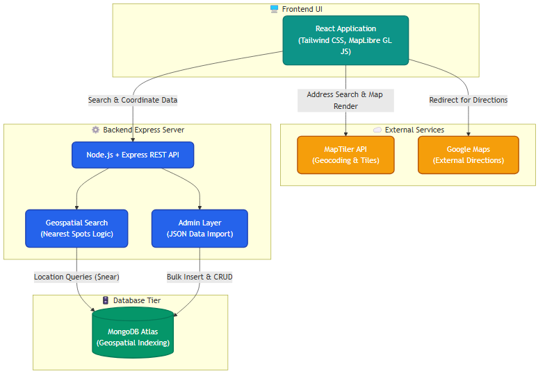

# ParkingTO - Toronto Parking Spot Finder

ParkFinder helps drivers quickly locate nearby parking in Toronto. It combines map search, nearest-spot detection, and parking dataset import into one app.

## What problem it solves
- Reduces time wasted searching for parking.
- Makes nearby options visible on an interactive map.
- Helps users compare closest lots quickly.

## Core features
- Search parking spots by name.
- Get autocomplete suggestions.
- Find the 5 nearest spots from map click coordinates.
- Import parking data from JSON on the admin side.

## Architecture diagram



## Tech stack
- Frontend: React, Tailwind CSS, MapLibre GL JS, MapTiler, Axios
- Backend: Node.js, Express, MongoDB Atlas, Mongoose

## API overview
- Public:
  - GET /park/spots
  - GET /park/spots/search/:name
  - GET /park/spots/searchNames/:query
  - POST /park/spots/nearestSpot
- Admin:
  - POST /admin/import-data
  - POST /admin/parking-spots
  - PUT /admin/parking-spots/:id
  - DELETE /admin/parking-spots/:id

## Quick start

1. Backend /

```bash
cd backend
npm install
node app.js
```

2. Frontend

```bash
cd frontend
npm install
npm start
```

Set required environment variables before running:
- backend: DB_USERNAME, DB_PASSWORD, PORT
- frontend: REACT_APP_MAP_API_KEY
